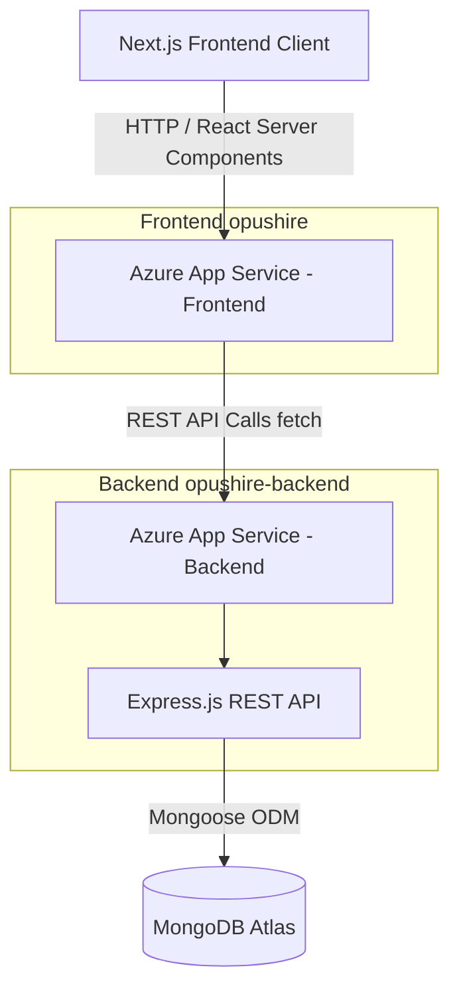
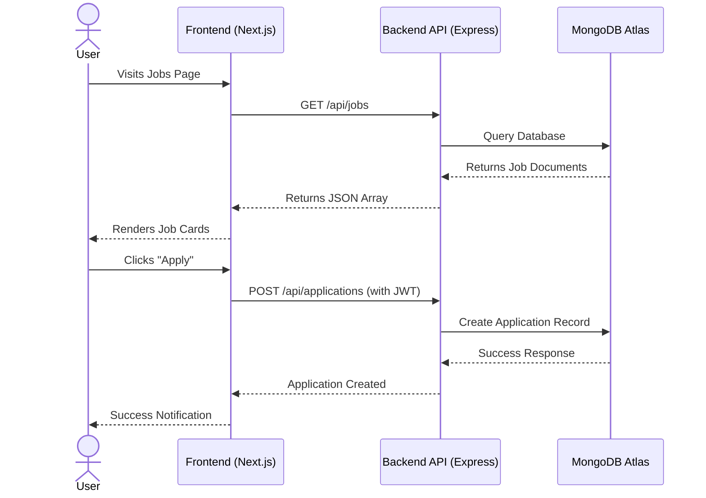

# Opushire

Opushire is a modern, full-stack job board and application tracking platform designed for students and professionals. The platform features an elegantly designed UI for job seekers to find and apply for jobs, and a robust admin/recruiter dashboard to manage job postings and track candidate applications.

## 🚀 Features

- **User Authentication**: Secure JWT-based registration and login for job seekers and recruiters.
- **Job Listings & Search**: Browse featured jobs and search by keywords, location, and job type.
- **Application Tracking**: Users can easily apply and track their job application statuses.
- **Admin Dashboard**: Dedicated portal for recruiters to post jobs, manage applications, and review candidate profiles.
- **Responsive Design**: Beautiful, responsive, and accessible UI built with Next.js and Tailwind CSS.
- **Secure Backend**: robust RESTful API built with Express and MongoDB.

---

## 🏗 System Architecture

The project is built using a decoupled architecture, separating the client application from the REST API backend.



### Component Interaction Flow



---

## 💻 Technology Stack

**Frontend (`/opushire`):**
- Framework: [Next.js](https://nextjs.org/) (App Router)
- Language: TypeScript
- Styling: Tailwind CSS & Framer Motion
- State/Data: React Context, Fetch API

**Backend (`/opushire-backend`):**
- Runtime: [Node.js](https://nodejs.org/)
- Framework: [Express](https://expressjs.com/)
- Database: [MongoDB Atlas](https://www.mongodb.com/) with Mongoose
- Security: Helmet, CORS, JWT Auth

---

## 🛠 Local Setup

### Prerequisites
- Node.js (v18+)
- MongoDB connection string (local or MongoDB Atlas)

### 1. Backend Setup
1. Navigate to the backend directory:
   ```bash
   cd opushire-backend
   ```
2. Install dependencies:
   ```bash
   npm install
   ```
3. Create a `.env` file based on `.env.example` (or set the following variables):
   ```env
   NODE_ENV=development
   PORT=5000
   MONGODB_URI=your_mongodb_connection_string
   JWT_SECRET=your_jwt_secret
   JWT_EXPIRES_IN=7d
   FRONTEND_URL=http://localhost:3000
   ```
4. Start the development server:
   ```bash
   npm run dev
   ```

### 2. Frontend Setup
1. Open a new terminal and navigate to the frontend directory:
   ```bash
   cd opushire
   ```
2. Install dependencies:
   ```bash
   npm install
   ```
3. Create a `.env.local` file:
   ```env
   NEXT_PUBLIC_API_URL=http://localhost:5000/api
   ```
4. Start the Next.js development server:
   ```bash
   npm run dev
   ```
5. Open [http://localhost:3000](http://localhost:3000) your browser.

---

## 🚀 Live Deployment

The application is fully deployed and hosted on **Microsoft Azure App Services** with continuous integration via **GitHub Actions**.

- **Live Frontend URL:** [https://opushire-frontend-app-hbarc3h7ckashzhb.centralindia-01.azurewebsites.net](https://opushire-frontend-app-hbarc3h7ckashzhb.centralindia-01.azurewebsites.net)
- **Live Backend API:** [https://opushire-backend.azurewebsites.net/api](https://opushire-backend.azurewebsites.net/api)
- **Database:** MongoDB Atlas (Cloud)

### CI/CD Pipeline
- **Frontend Workflow:** Changes pushed to the repository automatically trigger a GitHub Action sequence that builds the Next.js standalone application and zips it before deploying to the designated Azure App Service slot.
- **Backend Workflow:** Changes trigger an automated deployment to the Azure Node.js App Service container.
