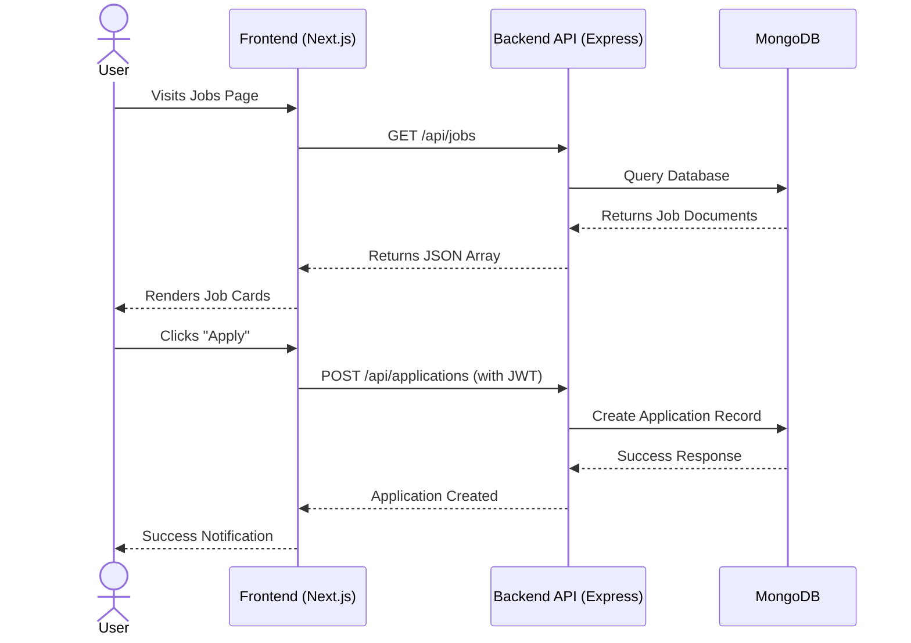

# Opushire

Opushire is a modern, full-stack job board and application tracking platform designed for students and professionals. The platform features an elegantly designed UI for job seekers to find and apply for jobs, and a robust admin/recruiter dashboard to manage job postings and track candidate applications.

## 🚀 Features

- **User Authentication**: Secure JWT-based registration and login for job seekers and recruiters.
- **Job Listings & Search**: Browse featured jobs and search by keywords, location, and job type.
- **Application Tracking**: Users can easily apply and track their job application statuses.
- **Admin Dashboard**: Dedicated portal for recruiters to post jobs, manage applications, and review candidate profiles.
- **Responsive Design**: Beautiful, responsive, and accessible UI built with Next.js and Tailwind CSS.
- **Secure Backend**: robust RESTful API built with Express and MongoDB.

---

## 🏗 System Architecture

The project is built using a decoupled architecture, separating the client application from the REST API backend.

```mermaid
graph TD
    Client[Next.js Frontend Client]
    Vercel[Vercel Edge Network]
    Render[Render Web Service]
    API[Express.js REST API]
    Mongo[(MongoDB Database)]

    Client -->|HTTP / React Server Components| Vercel
    Vercel -->|REST API Calls fetch| Render
    Render --> API
    API -->|Mongoose ODm| Mongo
    
    subgraph Frontend "Frontend (opushire/)"
    Vercel
    end
    
    subgraph Backend "Backend (opushire-backend/)"
    Render
    API
    end
```

### Component Interaction Flow



---

## 💻 Technology Stack

**Frontend (`/opushire`):**
- Framework: [Next.js](https://nextjs.org/) (App Router)
- Language: TypeScript
- Styling: Tailwind CSS & Framer Motion
- State/Data: React Context, Fetch API

**Backend (`/opushire-backend`):**
- Runtime: [Node.js](https://nodejs.org/)
- Framework: [Express](https://expressjs.com/)
- Database: [MongoDB](https://www.mongodb.com/) with Mongoose
- Security: Helmet, CORS, JWT Auth

---

## 🛠 Local Setup

### Prerequisites
- Node.js (v18+)
- MongoDB connection string (local or MongoDB Atlas)

### 1. Backend Setup
1. Navigate to the backend directory:
   ```bash
   cd opushire-backend
   ```
2. Install dependencies:
   ```bash
   npm install
   ```
3. Create a `.env` file based on `.env.example` (or set the following variables):
   ```env
   NODE_ENV=development
   PORT=5000
   MONGODB_URI=your_mongodb_connection_string
   JWT_SECRET=your_jwt_secret
   JWT_EXPIRES_IN=7d
   FRONTEND_URL=http://localhost:3000
   ```
4. Start the development server:
   ```bash
   npm run dev
   ```

### 2. Frontend Setup
1. Open a new terminal and navigate to the frontend directory:
   ```bash
   cd opushire
   ```
2. Install dependencies:
   ```bash
   npm install
   ```
3. Create a `.env.local` file:
   ```env
   NEXT_PUBLIC_API_URL=http://localhost:5000/api
   ```
4. Start the Next.js development server:
   ```bash
   npm run dev
   ```
5. Open [http://localhost:3000](http://localhost:3000) your browser.

---

## 🚀 Deployment

The repository is configured for automated deployments with leading cloud providers.

### Frontend Deployment (Vercel)
The `/opushire` application is configured to deploy easily on Vercel. Connect your GitHub repository to Vercel, set the Framework Preset to Next.js, and configure the Root Directory to `opushire`.
- Required Environment Variable: `NEXT_PUBLIC_API_URL`

### Backend Deployment (Render)
The `/opushire-backend` application includes a `render.yaml` configuration for Infrastructure-as-Code setups. Use the **Blueprint** feature on Render to automatically provision the server.
- The blueprint path should be set to: `opushire-backend/render.yaml`
- Required Environment Variables: `MONGODB_URI`, `JWT_SECRET`, `FRONTEND_URL`
