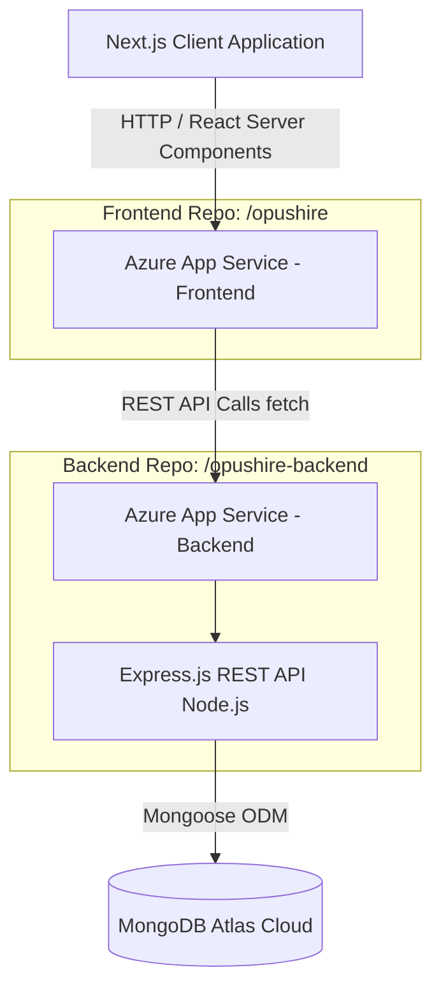

<div align="center">
  <br />
  <h1>Opushire 🚀</h1>
  <p><strong>Elevate your Career from Campus.</strong></p>
  <p>The premium job portal designed explicitly for high-growth students and top-tier tech startups.</p>
  <br />

  [](https://opushire-frontend-app-hbarc3h7ckashzhb.centralindia-01.azurewebsites.net)
  [](#)
  [](#)
  [](#)

</div>

---

## 🌟 Overview

Opushire is a modern, full-stack recruitment platform and application tracking system (ATS) crafted to seamlessly connect elite student talent with world-class technology companies (like Stripe, Vercel, Cred, and OpenAI). 

Built with an intense focus on **premium user experience**, **enterprise-grade architecture**, and an **immersive "glassmorphism" aesthetic**, Opushire provides an incredibly fast and fluid interface for both job seekers finding their dream internships and recruiters managing top-tier pipelines.

---

## ✨ Core Highlights

### 🎨 Stunning Premium UI/UX
- **Glassmorphism Aesthetic**: Deep, dark oceanic themes paired with frosted glass cards (`backdrop-blur`) built exclusively with the brand new **[Tailwind CSS v4](https://tailwindcss.com/)**.
- **Immersive Micro-interactions**: Smooth page transitions, animated dropdown panels, and hover events powered by **[Framer Motion](https://www.framer.com/motion/)**.
- **Custom Scrolling Marquees**: An infinite CSS-masked marquee displaying transparently faded trusted company logos.
- **Scroll Reveal Animations**: Elements gracefully slide and fade into view as you traverse the landing page using custom `ScrollReveal` wrappers.

### 🔐 Multi-Tier Role-Based Access (RBAC)
- Secure JSON Web Token (JWT) authentication handled via strict, HTTP-only cookies.
- **Student Portal**:
  - Live dashboards tracking the status of applied jobs (Interview, Shortlisted, Hired).
  - Saved opportunity tracking.
  - Interactive notification bells and dynamic preference settings panels.
- **Recruiter / Admin Portal**:
  - Securely manage organization profiles.
  - CRUD operations to post, edit, or remove live job listings.
  - Review candidate applications and adjust their progression pipeline statuses.

### 💼 Dynamic Indian Market Job Board
- Job listings dynamically render localized data designed for the Indian startup ecosystem (e.g., Salaries formatted as `₹35 LPA - ₹50 LPA`, and locations spanning `Bangalore, Pune, Gurgaon`).
- **Live Search & Filtering**: Client-side filtering across specific Categories (Engineering, Product), Job Types (Full-time, Internship), and Work Modes (Remote, Hybrid).
- Automatically fetches and renders high-quality company brand logos dynamically utilizing **Clearbit** APIs.

---

## 🏗 System Architecture & CI/CD

Opushire utilizes a globally distributed, decoupled client-server architecture. It is fully deployed on **Microsoft Azure** utilizing continuous integration via **GitHub Actions**.



### 🚀 Live Deployments

- **Frontend Application URL:** [https://opushire-frontend-app-hbarc3h7ckashzhb.centralindia-01.azurewebsites.net](https://opushire-frontend-app-hbarc3h7ckashzhb.centralindia-01.azurewebsites.net)
- **Backend API Endpoint:** [https://opushire-backend.azurewebsites.net/api](https://opushire-backend.azurewebsites.net/api)
- **Database System:** MongoDB Atlas

*Zero-downtime `.zip` builds and rapid container restarts are completely automated on GitHub pushes via `.github/workflows`.*

---

## 💻 Tech Stack Summary

**Frontend Application:**
- **Framework**: Next.js 14+ (App Router)
- **Language**: TypeScript
- **Styling Engine**: Tailwind CSS v4 & custom CSS variable architecture
- **Animations**: Framer Motion & GSAP
- **Icons**: Lucide React
- **State Management**: React Context APIs (`AuthContext`)

**Backend Application:**
- **Runtime Environment**: Node.js (v18+)
- **Server Framework**: Express.js
- **Database Architecture**: MongoDB utilizing Mongoose ODM
- **Security Protocols**: Helmet, CORS configurations, Bcrypt hashing, secure jsonwebtokens.

---

## 🛠 Local Development Guide

Want to run Opushire locally? Ensure you have **Node.js 18+** and a **MongoDB cluster connection string** ready.

### 1. Booting the Backend
1. Open a terminal and navigate to the API directory:
   ```bash
   cd opushire-backend
   ```
2. Install the necessary packages:
   ```bash
   npm install
   ```
3. Establish your localized `.env` variables:
   ```env
   NODE_ENV=development
   PORT=5000
   MONGODB_URI=your_mongodb_atlas_connection_string
   JWT_SECRET=your_super_secret_jwt_key
   JWT_EXPIRES_IN=7d
   FRONTEND_URL=http://localhost:3000
   ```
4. **Seed the Database!** (Highly Recommended to populate sample top-tier jobs and an Admin user):
   ```bash
   npx tsx seed-jobs.ts
   ```
5. Ignite the REST API server:
   ```bash
   npm run dev
   ```

### 2. Booting the Frontend
1. Open a *second* terminal and navigate to the client directory:
   ```bash
   cd opushire
   ```
2. Install the client packages:
   ```bash
   npm install
   ```
3. Point the client to your local backend API by creating a `.env.local` file:
   ```env
   NEXT_PUBLIC_API_URL=http://localhost:5000/api
   ```
4. Start the Next.js development environment:
   ```bash
   npm run dev
   ```
5. View the platform locally at [http://localhost:3000](http://localhost:3000). *(Note: If Tailwind CSS styles fail to load initially, simply delete the `.next` directory and restart the dev server—this clears Next.js's style cache for Tailwind v4!).*

---

> Built with 🩵 for high-growth students everywhere.
