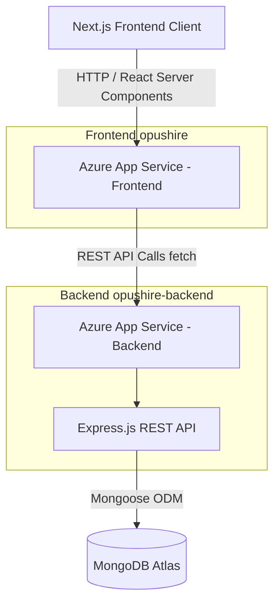

# Opushire

Opushire is a modern, full-stack recruitment platform designed to seamlessly connect elite talent with top-tier technology companies. Built with a focus on **premium user experience** and **enterprise-grade architecture**, Opushire offers an intuitive glassmorphic interface for job seekers and a powerful candidate management system for recruiters.

---

## ✨ Key Features

**🎨 Premium UI / UX Design**
- Fully responsive "Glassmorphism" aesthetic built with Tailwind CSS.
- Smooth page transitions and micro-animations powered by Framer Motion.
- Clean, distraction-free dashboards for both students and admins.

**🔐 Role-Based Access Control (RBAC)**
- Secure JWT authentication with strict `httpOnly` cookies.
- Differentiated user experiences: 
  - **Students**: Browse featured roles, apply to open positions, and track application statuses (Interview, Shortlisted, Hired) in real-time.
  - **Admins/Recruiters**: Manage company profiles, manually post/delete jobs, and review candidate applications through a dedicated operational portal.

**💼 Dynamic Job Board & Search Engine**
- Integrated with Clearbit for automatic, high-quality company logo loading via URL.
- Localized Indian recruitment options displaying INR salaries (e.g., ₹35 LPA - ₹50 LPA) and major tech hubs (Bangalore, Gurgaon, Pune).
- Live filtering capabilities by Category (Engineering, Product, Design), Job Type (Full-time, Internship, Contract), and Work Mode (Remote, Hybrid, Onsite).

**🚀 Fully Automated Cloud Infrastructure**
- Fully deployed on **Microsoft Azure App Services**.
- Backend infrastructure utilizes automated CI/CD pipelines via **GitHub Actions** for instant zero-downtime updates upon merging to the master branch.

---

## 🏗 System Architecture

The project is built using a decoupled architecture, separating the Next.js client application from the high-throughput Express.js REST API backend.



---

## 💻 Technology Stack

**Frontend (`/opushire`):**
- **Framework**: [Next.js 14+](https://nextjs.org/) (App Router, SSR/SSG combinations)
- **Language**: TypeScript
- **Styling**: Tailwind CSS & Framer Motion
- **Icons**: Lucide React
- **State/Data**: React Context API, Native Fetch

**Backend (`/opushire-backend`):**
- **Runtime**: [Node.js](https://nodejs.org/) (v18+)
- **Framework**: [Express](https://expressjs.com/)
- **Database**: [MongoDB Atlas](https://www.mongodb.com/) using Mongoose ODM
- **Security**: Helmet, CORS, bcrypt, jsonwebtoken

---

## 🚀 Live Deployment

The application is fully deployed and hosted on **Microsoft Azure App Services** with continuous integration via **GitHub Actions**.

- **Live Frontend URL:** [https://opushire-frontend-app-hbarc3h7ckashzhb.centralindia-01.azurewebsites.net](https://opushire-frontend-app-hbarc3h7ckashzhb.centralindia-01.azurewebsites.net)
- **Live Backend API:** [https://opushire-backend.azurewebsites.net/api](https://opushire-backend.azurewebsites.net/api)
- **Database:** MongoDB Atlas (Cloud)

### CI/CD Pipeline
- **Frontend Workflow:** Changes pushed to the repository automatically trigger a GitHub Action sequence that injects `NEXT_PUBLIC` API URL environments, builds the Next.js standalone application, and zips it before deploying to the designated Azure App Service slot.
- **Backend Workflow:** Changes trigger an automated deployment to the Azure Node.js App Service container, restarting the PM2 equivalent process to instantly serve the latest routes.

---

## 🛠 Local Development Setup

### Prerequisites
- Node.js (v18+)
- MongoDB Atlas Connection String (or local MongoDB instance)

### 1. Backend Setup
1. Navigate to the backend directory:
   ```bash
   cd opushire-backend
   ```
2. Install dependencies:
   ```bash
   npm install
   ```
3. Initialize the environment variables:
   ```env
   # .env
   NODE_ENV=development
   PORT=5000
   MONGODB_URI=your_mongodb_connection_string
   JWT_SECRET=your_jwt_secret
   JWT_EXPIRES_IN=7d
   FRONTEND_URL=http://localhost:3000
   ```
4. Seeding the Database (Optional but Recommended):
   Run the secure seeding script to automatically populate your cluster with an Admin user, and top-tier startup roles (Vercel, Stripe, Cred, OpenAI) with localized Indian locations/salaries.
   ```bash
   npx tsx seed-jobs.ts
   ```
5. Start the development server:
   ```bash
   npm run dev
   ```

### 2. Frontend Setup
1. Open a new terminal and navigate to the frontend directory:
   ```bash
   cd opushire
   ```
2. Install dependencies:
   ```bash
   npm install
   ```
3. Initialize the `.env.local` file:
   ```env
   # opushire/.env.local
   NEXT_PUBLIC_API_URL=http://localhost:5000/api
   ```
4. Start the Next.js development server:
   ```bash
   npm run dev
   ```
5. Open [http://localhost:3000](http://localhost:3000) your browser.
