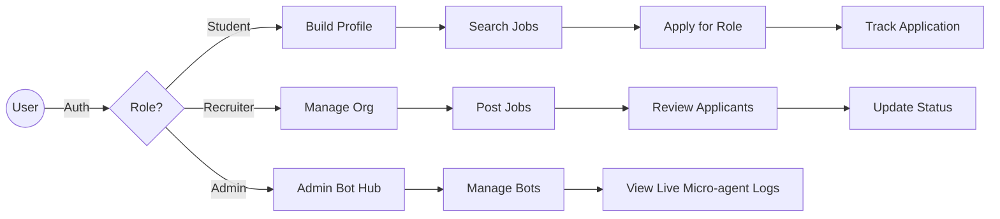
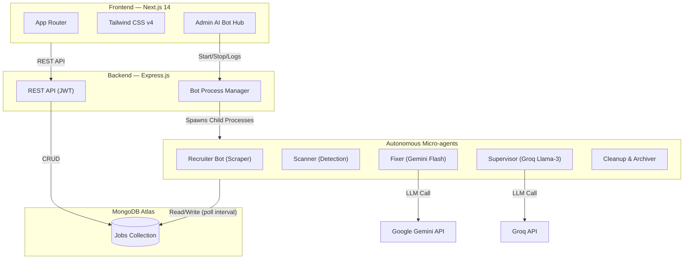

<div align="center">
  <br />
  <h1>OpusHire 🚀</h1>
  <p><strong>Elevate your Career from Campus.</strong></p>
  <p>The premium job portal designed explicitly for high-growth students, top-tier tech startups, and autonomous AI micro-agents.</p>
  <br />

  [](https://opushire-frontend-app-hbarc3h7ckashzhb.centralindia-01.azurewebsites.net)
  [](#)
  [](#)
  [](#)
  [](#)

</div>

---

## 🌟 Overview

OpusHire is a modern, full-stack recruitment platform and application tracking system (ATS) crafted to seamlessly connect top-tier student talent with world-class technology companies. 

Beyond standard job portal features, OpusHire implements an **Autonomous AI Ecosystem** consisting of several micro-agents that scrape jobs, clean data using LLMs, supervise each other to prevent hallucinations, and automatically archive expired roles.

---

## 📁 Monorepo Structure

OpusHire now utilizes **npm workspaces** for centralized dependency management and a cleaner root structure.

```
hackathon/
├── bots/                   ← Centralized AI Micro-agents
│   ├── scanner/            ← Detection: Flags messy job tags
│   ├── fixer/              ← LLM: Gemini Flash rewrites tags
│   ├── supervisor/         ← QA: Groq Llama-3 verifies outputs
│   ├── cleanup/            ← Core: Expired record rotation
│   └── archiver/           ← Core: Ghost job detector (Puppeteer)
├── opushire/               ← Frontend (Next.js 14 + Tailwind v4)
├── opushire-backend/       ← Backend API (Express.js + MongoDB)
├── recruiter-bot/          ← Autonomous Scraper (Telegram/APIs)
├── start-bots.js           ← Ecosystem orchestration script
├── package.json            ← Root Workspace Configuration
├── .github/workflows/      ← CI/CD pipelines (Azure deployment)
└── README.md
```

---

## 🗺️ User Journey


```mermaid
graph LR
    User((User)) -->|Auth| Dashboard{Role?}
    Dashboard -->|Student| S_Profile["Build Profile"]
    S_Profile --> S_Search["Search Jobs"]
    S_Search --> S_Apply["Apply for Role"]
    S_Apply --> S_Track["Track Application"]
    
    Dashboard -->|Recruiter| R_Org["Manage Org"]
    R_Org --> R_Post["Post Jobs"]
    R_Post --> R_Review["Review Applicants"]
    R_Review --> R_Status["Update Status"]
    
    Dashboard -->|Admin| A_Panel["Admin Bot Hub"]
    A_Panel --> A_Manage["Manage Bots"]
    A_Manage --> A_Logs["View Live Micro-agent Logs"]
```

---

## 🏗 System Architecture & AI Ecosystem

The architecture handles core portal logic alongside a background swarm of micro-agents organized into a unified workspace.


```mermaid
graph TD
    subgraph Frontend["Frontend — Next.js 14"]
        AppRouter["App Router"]
        TW["Tailwind CSS v4"]
        AdminDashboard["Admin AI Bot Hub"]
    end

    subgraph Backend["Backend — Express.js"]
        API["REST API (JWT)"]
        BotSpawner["Bot Process Manager"]
    end

    subgraph Database["MongoDB Atlas"]
        Jobs[(Jobs Collection)]
    end

    subgraph AI_Ecosystem["Autonomous Micro-agents"]
        Bot0["Recruiter Bot (Scraper)"]
        Bot1["Scanner (Detection)"]
        Bot2["Fixer (Gemini Flash)"]
        Bot3["Supervisor (Groq Llama-3)"]
        Bot4["Cleanup & Archiver"]
    end

    Frontend -->|"REST API"| API
    AdminDashboard -->|"Start/Stop/Logs"| BotSpawner
    BotSpawner -->|"Spawns Child Processes"| AI_Ecosystem
    API -->|"CRUD"| Jobs
    AI_Ecosystem -->|"Read/Write (poll interval)"| Jobs
    
    Bot2 -->|"LLM Call"| Gemini["Google Gemini API"]
    Bot3 -->|"LLM Call"| Groq["Groq API"]
```

---

## 🔒 The Multi-Agent Data Pipeline

OpusHire uses a chained agent architecture to ensure data quality without human intervention:

1. **Recruiter Bot**: Ingests messy, unformatted job postings from Telegram and external APIs.
2. **Scanner Bot**: Watches the DB. Flags jobs with excessively long or messy tags (`tagTileStatus: NEEDS_SHORTENING`).
3. **Fixer Bot**: Picks up flagged jobs. Uses **Gemini 1.5 Flash** to extract concise, 3-keyword summaries (`tagTileStatus: PENDING_REVIEW`).
4. **Supervisor Bot**: QA Agent. Uses **Groq Llama-3 70B** to verify Gemini's output against the original text. Overrides hallucinations and approves clean data (`tagTileStatus: VETTED`).
5. **Cleanup Bot**: Manages record rotation (soft-archives @ 1 week, hard-deletes @ 3 weeks).
6. **Archiver (Ghost Detector)**: Uses **Puppeteer** to visit external links and verify job availability, automatically archiving "ghost" postings.

---

## ✨ Core UI/UX Features

- **Premium Glassmorphism**: Deep dark oceanic themes with frosted glass cards (`backdrop-blur`).
- **Tactile Interactions**: Smooth, physics-based spring animations using Framer Motion.
- **Real-time Bot Hub**: Admins can start, stop, and monitor live streaming stdout/stderr terminal logs from the AI swarm.
- **Audio Visualizers**: Animated bar visualizers that pulse when an AI agent is actively online and processing.

---

## 💻 Tech Stack

| Layer | Technology |
|-------|-----------|
| **Frontend** | Next.js 14, TypeScript, Tailwind CSS v4, Framer Motion |
| **Backend** | Node.js, Express.js, TypeScript, Mongoose ODM |
| **Database** | MongoDB Atlas |
| **Agent LLMs** | Google Gemini 1.5 Flash, Groq Llama-3 70B |
| **Workspace** | npm Workspaces (Monorepo Management) |
| **Micro-agents** | Native Node.js `child_process` (cross-platform) |
| **CI/CD** | GitHub Actions (Zip-deployment strategy) |
| **Hosting** | Microsoft Azure App Service |

---

## 🚀 Live Deployments

| Service | URL |
|---------|-----|
| **Frontend Platform** | [opushire-frontend-app.azurewebsites.net](https://opushire-frontend-app-hbarc3h7ckashzhb.centralindia-01.azurewebsites.net) |
| **Backend API** | [opushire-backend-app.azurewebsites.net](https://opushire-backend-app-hbarc3h7ckashzhb.centralindia-01.azurewebsites.net/api/health) |

---

## 🛠 Local Development

OpusHire uses **npm Workspaces**. You can manage the entire project from the root.

### Prerequisites
- Node.js 20+
- MongoDB Atlas connection string
- Gemini & Groq API Keys

### 1. Setup
```bash
git clone https://github.com/soumik2441139/hackathon.git
cd hackathon
npm install  # Installs dependencies for ALL sub-projects at once
```

### 2. Environment Configuration
Create a `.env` file in the root or specifically in `opushire-backend/` containing:
`MONGODB_URI`, `JWT_SECRET`, `GEMINI_API_KEY`, `GROQ_API_KEY`, `PORT=5000`

### 3. Execution
- **Full Ecosystem**: Run `node start-bots.js` from the root.
- **Backend**: `cd opushire-backend && npm run dev`.
- **Frontend**: `cd opushire && npm run dev`.

---

> Built with 🩵 for high-growth students everywhere by **Soumik** and **Sagnik**.

