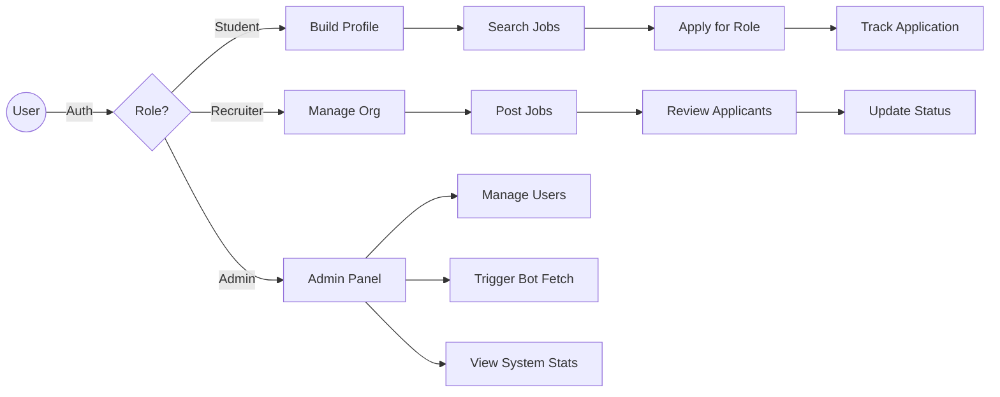
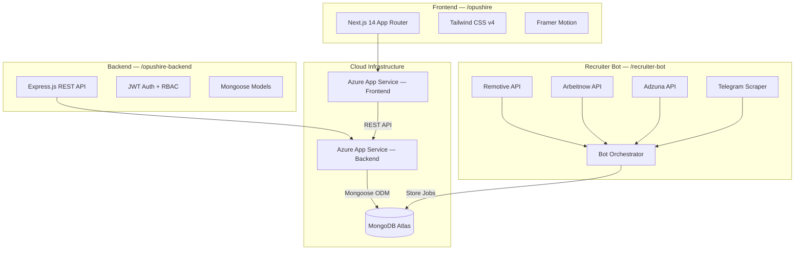
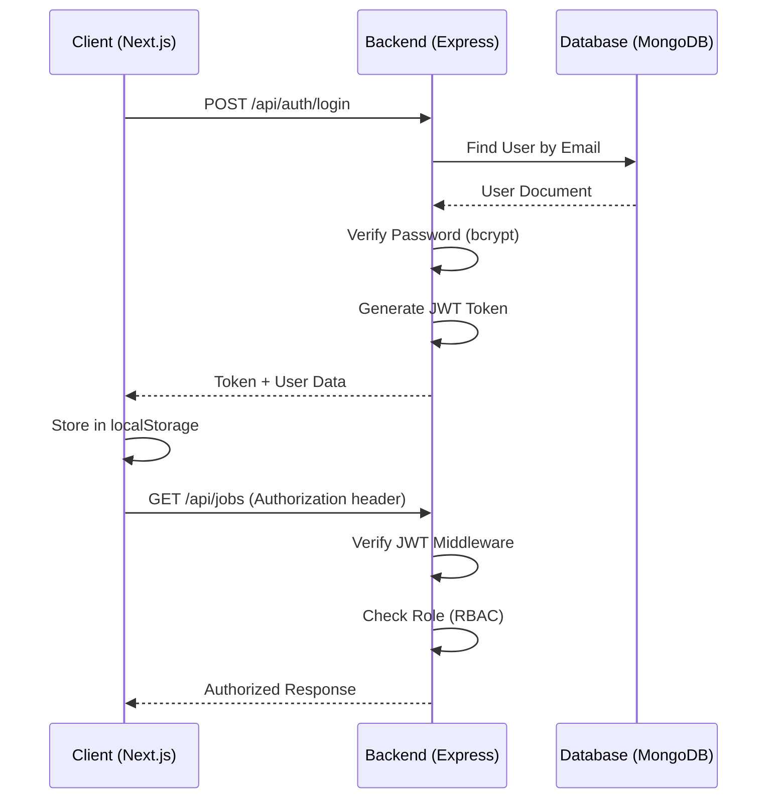
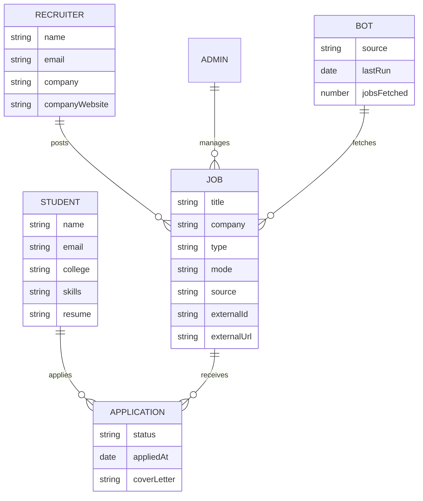
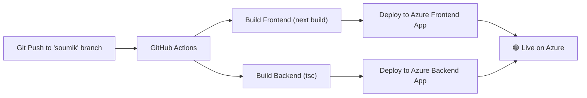

<div align="center">
  <br />
  <h1>OpusHire 🚀</h1>
  <p><strong>Elevate your Career from Campus.</strong></p>
  <p>The premium job portal designed explicitly for high-growth students and top-tier tech startups.</p>
  <br />

  [](https://opushire-frontend-app-hbarc3h7ckashzhb.centralindia-01.azurewebsites.net)
  [](#)
  [](#)
  [](#)
  [](#-recruiter-bot)

</div>

---

## 🌟 Overview

OpusHire is a modern, full-stack recruitment platform and application tracking system (ATS) crafted to seamlessly connect elite student talent with world-class technology companies. It features an **AI-powered Recruiter Bot** that automatically fetches internship and junior roles from 4 external sources.

---

## 📁 Monorepo Structure

```
hackathon/
├── opushire/               ← Frontend (Next.js 14 + Tailwind v4)
├── opushire-backend/       ← Backend API (Express.js + MongoDB)
├── recruiter-bot/          ← Autonomous Job Fetcher Bot
├── .github/workflows/      ← CI/CD pipelines (Azure deployment)
├── .gitignore
└── README.md
```

---

## 🗺️ User Journey


```mermaid
graph LR
    User((User)) -->|Auth| Dashboard{Role?}
    Dashboard -->|Student| S_Profile["Build Profile"]
    S_Profile --> S_Search["Search Jobs"]
    S_Search --> S_Apply["Apply for Role"]
    S_Apply --> S_Track["Track Application"]
    
    Dashboard -->|Recruiter| R_Org["Manage Org"]
    R_Org --> R_Post["Post Jobs"]
    R_Post --> R_Review["Review Applicants"]
    R_Review --> R_Status["Update Status"]
    
    Dashboard -->|Admin| A_Panel["Admin Panel"]
    A_Panel --> A_Users["Manage Users"]
    A_Panel --> A_Bot["Trigger Bot Fetch"]
    A_Panel --> A_Stats["View System Stats"]
```

---

## 🏗 System Architecture


```mermaid
graph TD
    subgraph Frontend["Frontend — /opushire"]
        NextJS["Next.js 14 App Router"]
        TW["Tailwind CSS v4"]
        FM["Framer Motion"]
    end

    subgraph Backend["Backend — /opushire-backend"]
        Express["Express.js REST API"]
        Auth["JWT Auth + RBAC"]
        Models["Mongoose Models"]
    end

    subgraph Bot["Recruiter Bot — /recruiter-bot"]
        Remotive["Remotive API"]
        Arbeitnow["Arbeitnow API"]
        Adzuna["Adzuna API"]
        Telegram["Telegram Scraper"]
        BotService["Bot Orchestrator"]
    end

    subgraph Cloud["Cloud Infrastructure"]
        AzureFE["Azure App Service — Frontend"]
        AzureBE["Azure App Service — Backend"]
        MongoDB[("MongoDB Atlas")]
    end

    NextJS --> AzureFE
    Express --> AzureBE
    AzureFE -->|"REST API"| AzureBE
    AzureBE -->|"Mongoose ODM"| MongoDB

    Remotive --> BotService
    Arbeitnow --> BotService
    Adzuna --> BotService
    Telegram --> BotService
    BotService -->|"Store Jobs"| MongoDB
```

---

## 🔐 Authentication Flow


```mermaid
sequenceDiagram
    participant C as Client (Next.js)
    participant B as Backend (Express)
    participant D as Database (MongoDB)
    
    C->>B: POST /api/auth/login
    B->>D: Find User by Email
    D-->>B: User Document
    B->>B: Verify Password (bcrypt)
    B->>B: Generate JWT Token
    B-->>C: Token + User Data
    C->>C: Store in localStorage
    C->>B: GET /api/jobs (Authorization header)
    B->>B: Verify JWT Middleware
    B->>B: Check Role (RBAC)
    B-->>C: Authorized Response
```

---

## 📊 Data Architecture


```mermaid
erDiagram
    STUDENT ||--o{ APPLICATION : applies
    RECRUITER ||--o{ JOB : posts
    ADMIN ||--o{ JOB : manages
    JOB ||--o{ APPLICATION : receives
    BOT ||--o{ JOB : fetches
    
    STUDENT {
        string name
        string email
        string college
        string skills
        string resume
    }
    RECRUITER {
        string name
        string email
        string company
        string companyWebsite
    }
    JOB {
        string title
        string company
        string type
        string mode
        string source
        string externalId
        string externalUrl
    }
    APPLICATION {
        string status
        date appliedAt
        string coverLetter
    }
    BOT {
        string source
        date lastRun
        number jobsFetched
    }
```

---

## ✨ Core Features

### 🎨 Premium UI/UX
- **Glassmorphism Aesthetic**: Deep dark oceanic themes with frosted glass cards (`backdrop-blur`)
- **Immersive Micro-interactions**: Smooth transitions powered by Framer Motion
- **Custom Scrolling Marquees**: Infinite CSS-masked marquee with company logos
- **Scroll Reveal Animations**: Elements gracefully animate on scroll

### 🔐 Multi-Tier RBAC
| Role | Capabilities |
|------|-------------|
| **Student** | Browse jobs, apply, track applications, manage profile |
| **Recruiter** | Post jobs, review applicants, update pipeline status |
| **Admin** | Manage all users, view system stats, trigger bot fetch, data re-sync |

### 🤖 Recruiter Bot
An autonomous job fetcher that pulls internship & junior roles from 4 external sources:

| Source | Type | API Key? |
|--------|------|----------|
| Remotive | REST API — remote tech jobs | No |
| Arbeitnow | REST API — tech jobs worldwide | No |
| Adzuna | REST API — 16+ countries | Yes |
| Telegram | Public channel scraper | No |

> See [`recruiter-bot/README.md`](recruiter-bot/README.md) for full architecture details.

---

## 💻 Tech Stack

| Layer | Technology |
|-------|-----------|
| **Frontend** | Next.js 14, TypeScript, Tailwind CSS v4, Framer Motion, Lucide Icons |
| **Backend** | Node.js, Express.js, TypeScript, Mongoose ODM |
| **Database** | MongoDB Atlas |
| **Auth** | JWT, bcryptjs, Role-Based Middleware |
| **Bot** | Axios, Cheerio-style HTML parsing, Clearbit Logos |
| **CI/CD** | GitHub Actions → Azure App Service |
| **Hosting** | Microsoft Azure (Central India region) |

---

## 🚀 Live Deployments

| Service | URL |
|---------|-----|
| **Frontend** | [opushire-frontend-app.azurewebsites.net](https://opushire-frontend-app-hbarc3h7ckashzhb.centralindia-01.azurewebsites.net) |
| **Backend API** | [opushire-backend.azurewebsites.net/api](https://opushire-backend.azurewebsites.net/api) |
| **Health Check** | [opushire-backend.azurewebsites.net/health](https://opushire-backend.azurewebsites.net/health) |

---

## 🛠 Local Development

### Prerequisites
- Node.js 18+
- MongoDB Atlas connection string (or local MongoDB)

### 1. Backend
```bash
cd opushire-backend
npm install
# Create .env with: MONGODB_URI, JWT_SECRET, FRONTEND_URL, PORT=5000
npm run dev
```

### 2. Frontend
```bash
cd opushire
npm install
# Create .env.local with: NEXT_PUBLIC_API_URL=http://localhost:5000/api
npm run dev
# Open http://localhost:3000
```

### 3. Recruiter Bot
```bash
cd recruiter-bot
npm install
cp .env.example .env
# Edit .env → set MONGODB_URI
npm run dev
# Dashboard at http://localhost:5001
```

### 4. Seed Sample Data
```bash
cd opushire-backend
npx tsx seed-jobs.ts
```

---

## 📂 Project Organization

```
opushire/                        ← Next.js Frontend
├── app/
│   ├── page.tsx                 ← Landing page
│   ├── jobs/page.tsx            ← Job board
│   ├── dashboard/
│   │   ├── student/page.tsx     ← Student dashboard
│   │   ├── recruiter/page.tsx   ← Recruiter dashboard
│   │   └── admin/page.tsx       ← Admin panel
│   └── auth/                    ← Login / Register
├── components/ui/               ← Reusable UI components
├── context/AuthContext.tsx       ← Auth state management
└── lib/api.ts                   ← API client helpers

opushire-backend/                ← Express Backend
├── src/
│   ├── server.ts                ← App entry point
│   ├── config/                  ← DB, CORS, env config
│   ├── models/                  ← Mongoose schemas
│   ├── routes/                  ← Express route definitions
│   ├── controllers/             ← Request handlers
│   ├── services/                ← Business logic
│   └── middleware/              ← Auth, RBAC, error handling
├── logs/                        ← Historical log files
├── seed-jobs.ts                 ← Database seeder
└── migrate-data.js              ← Data migration utility

recruiter-bot/                   ← Autonomous Job Fetcher
├── src/
│   ├── providers/               ← External API integrations
│   ├── models/Job.ts            ← Shared Job schema
│   ├── bot.service.ts           ← Orchestrator
│   ├── server.ts                ← API + Dashboard
│   └── cli.ts                   ← CLI runner
└── .env.example                 ← Configuration template
```

---

## 🔄 CI/CD Pipeline


```mermaid
graph LR
    Push["Git Push to 'soumik' branch"] --> GHA["GitHub Actions"]
    GHA --> BuildFE["Build Frontend (next build)"]
    GHA --> BuildBE["Build Backend (tsc)"]
    BuildFE --> DeployFE["Deploy to Azure Frontend App"]
    BuildBE --> DeployBE["Deploy to Azure Backend App"]
    DeployFE --> Live["🟢 Live on Azure"]
    DeployBE --> Live
```

---

> Built with 🩵 for high-growth students everywhere by Soumik and [Sagnik](https://github.com/SagnikSarkar31).
