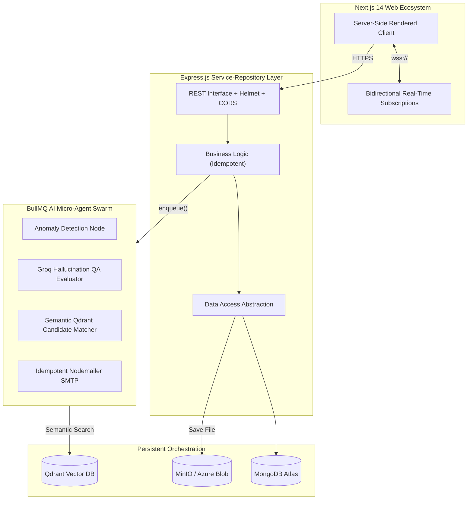

<div align="center">
  <br />
  <h1>OpusHire 🚀</h1>
  <p><strong>Enterprise-Grade Autonomous Career Protocol.</strong></p>
  <p>An elite, cloud-native orchestration ecosystem connecting high-growth student talent with top-tier tech startups using localized Vector Search, Triple-Redis Job Queuing, and specialized AI Micro-Agents.</p>
  <br />

  [](https://opushire-frontend-app-hbarc3h7ckashzhb.centralindia-01.azurewebsites.net)
  [](#)
  [](#)
  [](#)

</div>

---

## 🌟 God-Tier Cloud Architecture

OpusHire transcends traditional job platforms through a sophisticated, event-driven microservices architecture. Designed for 100% horizontal scalability, the entire ecosystem is flawlessly orchestrated using Docker Compose.

### Core Engineering Feats:
- ⚡ **Triple-Redis Queue Intelligence:** Utilizes a highly-available caching layer split into three routing domains (Core Routing, Background AI Workers, and Caching) using strict `BullMQ` idempotency.
- 🧠 **Cosine Vector Search Engine:** Directly embeds Google Gemini API generated 768-D mathematically dense representations into `Qdrant`, calculating cosine similarity matrixes instantly to trigger Auto-Match emails for high-scoring applicants.
- 🗄️ **Service-Repository Design Pattern:** Rigidly decouples Express.js API logic from MongoDB `Mongoose` abstractions, enabling pure domain-driven unit testing.
- 🔐 **Advanced Container Security:** Engineered entirely against Privileged Escalation bugs by safely dropping to a `USER node` sandbox context within Docker, securely obscured via custom `Helmet` directives and 10min/10req authentication Rate Limiters.

---

## 🏗 Full-Stack Ecosystem Map


```mermaid
graph TD
    subgraph Client["Next.js 14 Web Ecosystem"]
        Frontend["Server-Side Rendered Client"]
        WebSocket["Bidirectional Real-Time Subscriptions"]
    end

    subgraph Controller["Express.js Service-Repository Layer"]
        API["REST Interface + Helmet + CORS"]
        Services["Business Logic (Idempotent)"]
        Repo["Data Access Abstraction"]
    end

    subgraph State["Persistent Orchestration"]
        Mongo[(MongoDB Atlas)]
        Qdrant[(Qdrant Vector DB)]
        S3[(MinIO / Azure Blob)]
    end

    subgraph Workers["BullMQ AI Micro-Agent Swarm"]
        Scan["Anomaly Detection Node"]
        Groq["Groq Hallucination QA Evaluator"]
        Match["Semantic Qdrant Candidate Matcher"]
        Mail["Idempotent Nodemailer SMTP"]
    end

    Frontend <-->|"wss://"| WebSocket
    Frontend -->|"HTTPS"| API
    API --> Services --> Repo --> Mongo
    Services -->|"enqueue()"| Workers
    Workers -->|"Semantic Search"| Qdrant
    Repo -->|"Save File"| S3
```

---

## ⚙️ The Multi-Agent Data Pipeline

OpusHire's AI automation executes completely stripped of `child_process` overhead, instead leveraging scalable native BullMQ threads.
1. **Anomaly Detector**: A lightweight, aggressive queue worker sweeping up newly-posted data.
2. **LLM QA Matrix**: Automatically forces `Gemini 1.5 Flash` processing summaries to pass through a highly-scrutinized validation script generated by `Groq Llama-3`.
3. **Ghost Purger**: Gracefully auto-archives job postings older than strict threshold TTLs to guarantee an impeccably fresh Applicant Sandbox.
4. **Auto-Match Emailer**: Pings Qdrant to find resume vectors `>80%` similar to new job vectors, dispatching rich HTML emails securely without triggering SMTP spam traps.

---

## 💻 Elite Tech Stack

| Layer | Enterprise Technology Applied |
|-------|-----------|
| **Orchestration** | Docker Compose, GitHub Actions |
| **Object Storage** | S3 API Protocol (Local MinIO & Azure Blob) |
| **Data Layers** | MongoDB Atlas, Qdrant (HNSW Cosine Math) |
| **Caching/Queueing** | Redis (`ioredis`), `bullmq` |
| **Frontend Platform** | Next.js 14, App Router, SSR, Framer Motion |
| **Backend Cluster** | Node.js, Express.js (Service-Repo pattern) |

---

## 🚀 Live Production Deployment

OpusHire is strictly automated across Microsoft Azure infrastructure:

| Service | Geographic Location | Endpoint URL |
|---------|-----|-----|
| **Next.js Edge Cluster** | Central India | [opushire-frontend-app.azurewebsites.net](https://opushire-frontend-app-hbarc3h7ckashzhb.centralindia-01.azurewebsites.net) |
| **Express Backend Core** | Central India | [opushire-backend-app.azurewebsites.net/api/health](https://opushire-backend-app-hbarc3h7ckashzhb.centralindia-01.azurewebsites.net/api/health) |

---

## 🛠 Zero-Friction Setup

You can spin up the entire multi-container enterprise ecosystem on your localhost with a single standard shell command.

### 1. Requirements
Ensure you possess a `.env` configured properly and Docker Engine actively polling.

### 2. Ignition Protocol
```bash
# Clone the repository
git clone https://github.com/soumik2441139/hackathon.git
cd hackathon

# Launch the God-Tier 9-Container Orchestrator
# (Deploys: Nginx, Frontend, Backend, primary/sec/tert Redis, Mongo, MinIO, Qdrant)
docker compose up --build -d
```

---


