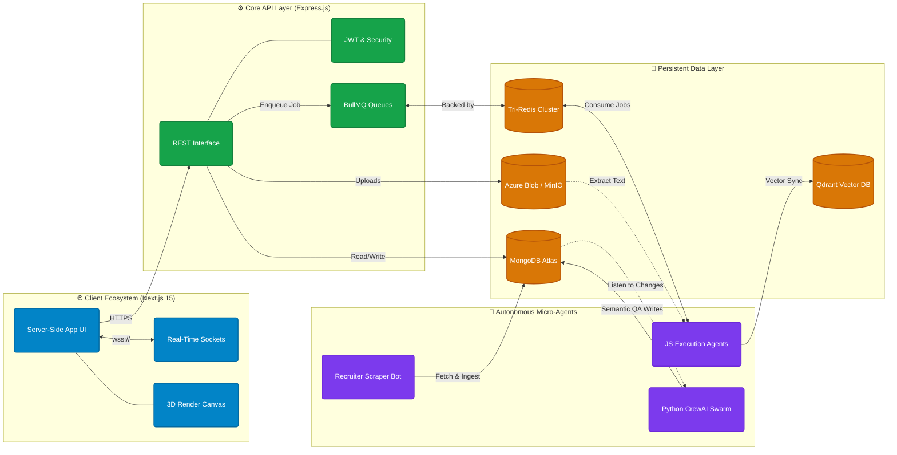
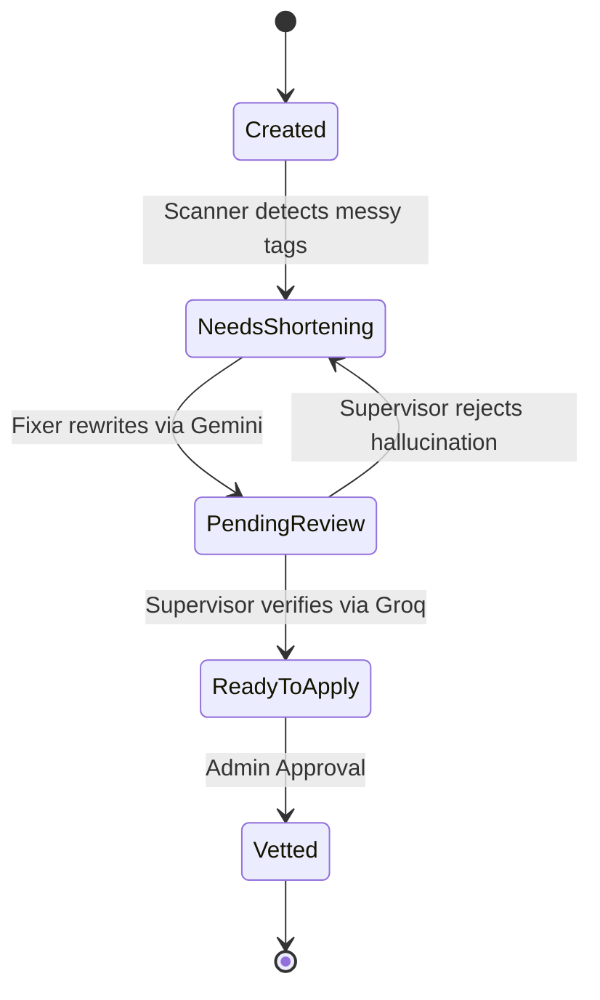
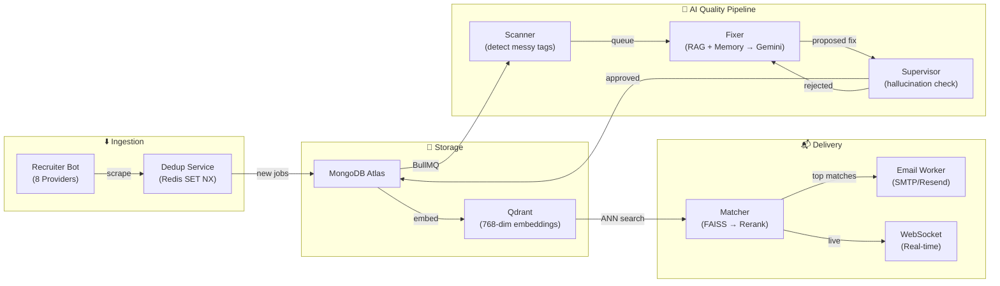
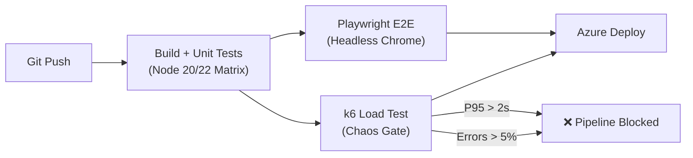

<div align="center">
  <br />
  <h1>🚀 OpusHire</h1>
  <p><strong>Distributed Autonomous Career Protocol</strong></p>
  <p>A high-performance, cloud-native orchestration ecosystem connecting student talent with leading tech companies using localized Vector Search, Triple-Redis Job Queuing, and specialized AI Micro-Agents.</p>
  <br />

  [](https://opushire-frontend-app-hbarc3h7ckashzhb.centralindia-01.azurewebsites.net)
  [](#)
  [](#)
  [](#)
  [](#)
  [](#)
  [](#)
  [](#)

</div>

---

## 🌟 Overview & Core Engineering

OpusHire provides a sophisticated, event-driven microservices architecture designed for horizontal scalability. The entire ecosystem relies on intelligent AI agents, vector matching, and robust asynchronous queues.

- ⚡ **Triple-Redis Queue Intelligence:** Utilizes a highly-available caching layer split into domains (Core Routing, Background AI Workers, and Caching) using strict `BullMQ` idempotency.
- 🧠 **Cosine Vector Search Engine:** Embeds Google Gemini 768-D mathematically dense representations into `Qdrant`, calculating cosine similarity matrixes instantly to trigger Auto-Match emails for high-scoring applicants.
- 🤖 **Multi-Agent Orchestration:** Deploys a hybrid Python (`CrewAI`) and Node.js swarm to maintain data quality, flag hallucinations, and scrape real-time job listings without human intervention.
- 🛡 **Resilience & Observability:** Hardened "Safe-LLM" Router capable of dynamic multi-tier fallback (OpenRouter → Groq → Gemini) guaranteeing zero-downtime AI availability, coupled with a deep-probe System Dashboard tracking active Socket / Database Heartbreaks.
- 🔐 **Advanced Container Security:** Engineered against SSRF, NoSQL Injections, and Privileged Escalation, cleanly dropping into a `USER node` sandbox context within Docker.

---

## 🏗 Full-Stack Ecosystem Architecture


```mermaid
flowchart LR
    %% Aesthetics
    classDef client fill:#0284c7,stroke:#0369a1,stroke-width:2px,color:#fff,rx:5px,padding:10px;
    classDef backend fill:#16a34a,stroke:#15803d,stroke-width:2px,color:#fff,rx:5px,padding:10px;
    classDef storage fill:#d97706,stroke:#b45309,stroke-width:2px,color:#fff,rx:5px,padding:10px;
    classDef swarm fill:#7c3aed,stroke:#6d28d9,stroke-width:2px,color:#fff,rx:5px,padding:10px;

    subgraph Client ["🌐 Client Ecosystem (Next.js 15)"]
        direction TB
        UI["Server-Side App UI"]:::client
        WS["Real-Time Sockets"]:::client
        Three["3D Render Canvas"]:::client
        UI --- Three
        UI <-->|"wss://"| WS
    end

    subgraph Backend ["⚙️ Core API Layer (Express.js)"]
        direction TB
        API["REST Interface"]:::backend
        Auth["JWT & Security"]:::backend
        Queue["BullMQ Queues"]:::backend
        API --- Auth
    end

    subgraph Swarm ["🤖 Autonomous Micro-Agents"]
        direction TB
        Recruiter["Recruiter Scraper Bot"]:::swarm
        JSBots["JS Execution Agents"]:::swarm
        CrewAI["Python CrewAI Swarm"]:::swarm
    end

    subgraph Storage ["💾 Persistent Data Layer"]
        direction TB
        Mongo[(MongoDB Atlas)]:::storage
        S3[(Azure Blob / MinIO)]:::storage
        Qdrant[(Qdrant Vector DB)]:::storage
        Redis[(Tri-Redis Cluster)]:::storage
    end

    %% Primary Data Flow - Left to Right
    UI -->|"HTTPS"| API
    
    API -->|"Uploads"| S3
    API -->|"Read/Write"| Mongo
    API -->|"Enqueue Job"| Queue
    
    Queue <-->|"Backed by"| Redis
    Redis <-->|"Consume Jobs"| JSBots
    
    S3 -.->|"Extract Text"| JSBots
    JSBots -->|"Vector Sync"| Qdrant
    
    Mongo -.->|"Listen to Changes"| CrewAI
    CrewAI -->|"Semantic QA Writes"| Mongo
    
    Recruiter -->|"Fetch & Ingest"| Mongo
```

---

## ⚙️ Infrastructure & DevOps

### One-Command Deployment

```bash
# Local: Spin up 10 health-checked containers in ~3 minutes
docker compose up --build -d

# Cloud: Provision full Azure stack (App Services, Redis, ACR, App Insights)
cd infrastructure && terraform apply -auto-approve
```

### 10-Container Docker Compose

| # | Service | Image | Health Check | Purpose |
|---|---|---|---|---|
| 1 | Nginx Gateway | `nginx:1.27-alpine` | HTTP probe | API routing & SSL termination |
| 2 | Next.js Frontend | Custom | HTTP probe | Server-rendered React UI |
| 3 | Express API | Custom | HTTP probe | REST API + WebSocket |
| 4 | MongoDB | `mongo:6.0` | `mongosh ping` | Primary data store |
| 5 | Redis Primary | `redis:7.2-alpine` | `redis-cli ping` | BullMQ core routing |
| 6 | Redis Secondary | `redis:7.2-alpine` | `redis-cli ping` | AI worker isolation |
| 7 | Redis Tertiary | `redis:7.2-alpine` | `redis-cli ping` | Caching & idempotency |
| 8 | MinIO | `minio/minio` | `mc ready` | S3-compatible storage |
| 9 | Qdrant | `qdrant/qdrant` | HTTP probe | 768-dim vector search |
| 10 | Jaeger | `jaegertracing/all-in-one` | HTTP probe | Distributed trace UI |

### Terraform Resources (Azure)

| Resource | Purpose |
|---|---|
| `azurerm_service_plan` | Linux B1 App Service Plan |
| `azurerm_linux_web_app` × 2 | Frontend + Backend Web Apps |
| `azurerm_redis_cache` | Azure Cache for Redis (noeviction) |
| `azurerm_container_registry` | Docker image storage |
| `azurerm_application_insights` | APM & distributed tracing |
| `azurerm_log_analytics_workspace` | Centralized log aggregation |

---

## 🔭 Observability & Distributed Tracing

### OpenTelemetry + Jaeger

Every request is traced end-to-end across the distributed system:

```
HTTP Request → Express (auto-instrumented)
    → Redis/BullMQ (auto-instrumented)
        → Worker (trace context propagated via job data)
            → LLM API (wrapped in circuit breaker OTel spans)
                → Qdrant Vector Search (auto-instrumented)
```

**Trace UI:** `http://localhost:16686` (Jaeger) after `docker compose up`

### Prometheus Metrics

| Metric | Type | Description |
|---|---|---|
| `opushire_llm_response_seconds` | Histogram | LLM API latency by model |
| `opushire_hallucinations_caught_total` | Counter | Rejected hallucinated tags |
| `opushire_circuit_breaker_transitions_total` | Counter | Circuit state changes |
| `opushire_queue_depth` | Gauge | Waiting jobs per queue |

### Structured Logging (Pino)

Every log line automatically includes `traceId` and `spanId` via `AsyncLocalStorage` — enabling correlation between logs and distributed traces without manual instrumentation.

---

## 🤖 The AI Autonomous Pipeline

### Job Vetting State Machine

```mermaid
stateDiagram-v2
    [*] --> Created
    Created --> NeedsShortening : Scanner detects messy tags
    NeedsShortening --> PendingReview : Fixer rewrites via Gemini
    PendingReview --> ReadyToApply : Supervisor verifies via Groq
    PendingReview --> NeedsShortening : Supervisor rejects hallucination
    ReadyToApply --> Vetted : Admin Approval
    Vetted --> [*]
```

### End-to-End Data Flow


```mermaid
flowchart LR
    subgraph Ingestion ["⬇️ Ingestion"]
        R["Recruiter Bot\n(8 Providers)"]
        D["Dedup Service\n(Redis SET NX)"]
    end

    subgraph QA ["🤖 AI Quality Pipeline"]
        S["Scanner\n(detect messy tags)"]
        F["Fixer\n(RAG + Memory → Gemini)"]
        SV["Supervisor\n(hallucination check)"]
    end

    subgraph Storage ["💾 Storage"]
        M["MongoDB Atlas"]
        Q["Qdrant\n(768-dim embeddings)"]
    end

    subgraph Delivery ["📬 Delivery"]
        MA["Matcher\n(FAISS → Rerank)"]
        E["Email Worker\n(SMTP/Resend)"]
        WS["WebSocket\n(Real-time)"]
    end

    R -->|"scrape"| D -->|"new jobs"| M
    M -->|"BullMQ"| S -->|"queue"| F
    F -->|"proposed fix"| SV
    SV -->|"approved"| M
    SV -->|"rejected"| F
    M -->|"embed"| Q
    Q -->|"ANN search"| MA
    MA -->|"top matches"| E
    MA -->|"live"| WS
```

---

## 🛡 Idempotency & Resilience

### Request-Level Idempotency (Stripe Pattern)

```
POST /api/jobs (Idempotency-Key: uuid-123)
    → Redis SET NX lock (30s TTL)
    → Process request → Cache response (24h TTL)
    → Duplicate request → Return cached response + X-Idempotent-Replayed header
    → Concurrent duplicate → 409 Conflict
```

### Queue-Level Idempotency (BullMQ)

Jobs with the same `_idempotencyKey` are silently deduplicated by BullMQ's native `jobId` mechanism.

### Circuit Breakers

| Provider | Failure Threshold | Reset Timeout | Recovery Probes |
|---|---|---|---|
| Gemini | 5 failures | 30s | 2 successes |
| Groq | 5 failures | 30s | 2 successes |

Each circuit breaker execution is wrapped in an OpenTelemetry span with `circuit_breaker.state` and `circuit_breaker.failure_count` attributes.

---

## 🧪 Testing & CI/CD

### 3-Stage Chaos-Gated Pipeline


```mermaid
flowchart LR
    Push["Git Push"] --> Build["Build + Unit Tests\n(Node 20/22 Matrix)"]
    Build --> E2E["Playwright E2E\n(Headless Chrome)"]
    Build --> Chaos["k6 Load Test\n(Chaos Gate)"]
    E2E --> Deploy["Azure Deploy"]
    Chaos --> Deploy
    Chaos -->|"P95 > 2s"| FAIL["❌ Pipeline Blocked"]
    Chaos -->|"Errors > 5%"| FAIL
```

| Test Type | Tool | Count | Scope |
|---|---|---|---|
| Unit Tests | Jest | 8 suites | Circuit breaker, cosine similarity, sanitization, idempotency, etc. |
| E2E Tests | Playwright | 3 suites | Landing, authentication, dashboard |
| Load Tests | k6 | 5 scenarios | Health, jobs, single job, 404, detailed health |
| Chaos Gate | k6 thresholds | Automated | **Fails pipeline if P95 > 2s or error > 5%** |

---

## 📂 Project Directory Structure

### 1. `opushire/` (Next.js Frontend)
The sleek client-facing web application built with **Next.js 15, React 19, TailwindCSS 4, and Framer Motion**.
- **Visuals:** Immersive 3D interactions via `@react-three/fiber` and ultra-smooth scrolling using `lenis`.
- **Real-time:** Live status updates via `socket.io-client`.

### 2. `opushire-backend/` (Core API)
The **Express.js API Node** following a Service-Repository pattern.
- **Queues:** `BullMQ` for high-throughput job scheduling.
- **Vectors:** `Qdrant` integrations for high-performance similarity search.
- **Storage:** Multi-provider S3/Azure Blob support for resume persistence.

### 3. `bots/` (JS Autonomous Micro-Agents)
A swarm of 8 independent workers:
- **Scanner/Fixer/Supervisor:** The AI "Editorial" team.
- **Cleanup/Archiver:** Data lifecycle management with `Puppeteer` for URL health checks.
- **Matcher/Advisor:** High-level AI insights and candidate matching.

### 4. `agents/` (Python CrewAI)
Advanced Python orchestration layer:
- Hooks into **MongoDB Change Streams** for real-time reactivity.
- Employs **Redis Queue (RQ)** for inter-process communication between Python and Node.

### 5. `infrastructure/` (DevOps)
- **Terraform:** `main.tf` for Azure Resource orchestration (7 resources).
- **Docker:** Production-ready 10-container orchestrator with healthchecks.
- **Nginx:** Reverse proxy configuration with hardened headers.

---

## 🔐 Security & Observability

- **CodeQL Hardened:** Remedied critical vulnerabilities including SSRF, NoSQL Injection, and Path Traversal.
- **Custom Sanitization:** Replaced deprecated middlewares with a high-performance custom `mongoSanitize` layer for Express 5 compatibility.
- **Observability:** OpenTelemetry distributed tracing, Prometheus metrics, Pino structured logging with async-safe `traceId` propagation.
- **Idempotency:** Stripe-pattern request deduplication preventing double-processing in async pipelines.

---

## 🚀 Deployment & Local Setup

### Live Production
- **Frontend:** [Azure App Service](https://opushire-frontend-app-hbarc3h7ckashzhb.centralindia-01.azurewebsites.net)
- **Backend:** [Azure App Service (Central India)](https://opushire-backend-app-hbarc3h7ckashzhb.centralindia-01.azurewebsites.net/api/health)
- **Jaeger UI:** `http://localhost:16686` (local Docker only)

### Local Ignition
```bash
# Launch the production-ready multi-container ecosystem
docker compose up --build -d

# Verify all services are healthy
docker compose ps

# View distributed traces
open http://localhost:16686
```

### Prerequisites
- Node.js (v20+), Python (v3.10+), Docker Engine.
- `.env` configured with `GEMINI_API_KEY` and `MONGODB_URI`.

---

## Built By

**Soumik** — 4th Year BTech, KIIT University  
*Open to SDE-1 opportunities at scale-driven companies.*
