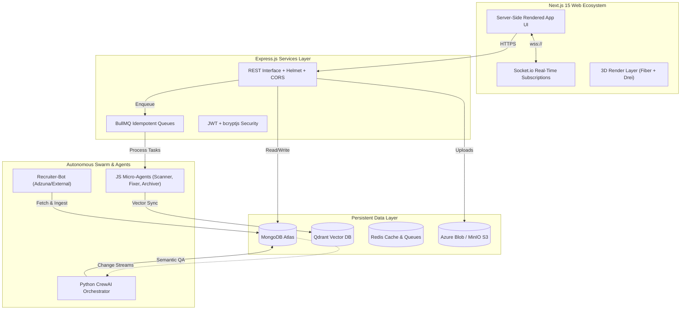
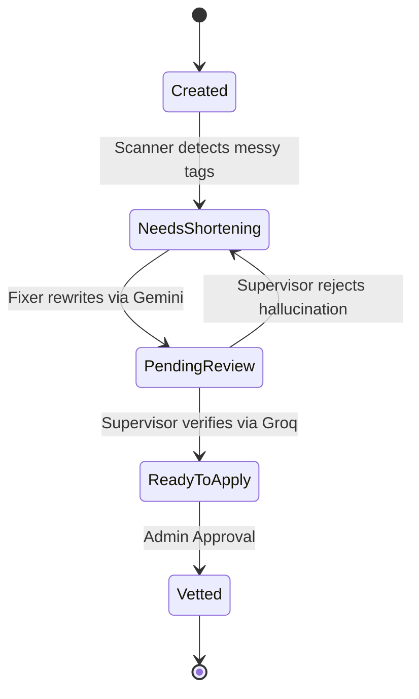

<div align="center">
  <br />
  <h1>🚀 OpusHire</h1>
  <p><strong>Enterprise-Grade Autonomous Career Protocol</strong></p>
  <p>A high-performance, cloud-native orchestration ecosystem connecting student talent with leading tech companies using localized Vector Search, Triple-Redis Job Queuing, and specialized AI Micro-Agents.</p>
  <br />

  [](https://opushire-frontend-app-hbarc3h7ckashzhb.centralindia-01.azurewebsites.net)
  [](#)
  [](#)
  [](#)
  [](#)
  [](#)

</div>

---

## 🌟 Overview & Core Engineering

OpusHire provides a sophisticated, event-driven microservices architecture designed for horizontal scalability. The entire ecosystem relies on intelligent AI agents, vector matching, and robust asynchronous queues.

- ⚡ **Triple-Redis Queue Intelligence:** Utilizes a highly-available caching layer split into domains (Core Routing, Background AI Workers, and Caching) using strict `BullMQ` idempotency.
- 🧠 **Cosine Vector Search Engine:** Embeds Google Gemini 768-D mathematically dense representations into `Qdrant`, calculating cosine similarity matrixes instantly to trigger Auto-Match emails for high-scoring applicants.
- 🤖 **Multi-Agent Orchestration:** Deploys a hybrid Python (`CrewAI`) and Node.js swarm to maintain data quality, flag hallucinations, and scrape real-time job listings without human intervention.
- 🔐 **Advanced Container Security:** Engineered against SSRF, NoSQL Injections, and Privileged Escalation, cleanly dropping into a `USER node` sandbox context within Docker.

---

## 🏗 Full-Stack Ecosystem Architecture


```mermaid
graph TD
    subgraph Client ["Next.js 15 Web Ecosystem"]
        Frontend["Server-Side Rendered App UI"]
        WebSocket["Socket.io Real-Time Subscriptions"]
        ThreeJS["3D Render Layer (Fiber + Drei)"]
    end

    subgraph Backend ["Express.js Services Layer"]
        API["REST Interface + Helmet + CORS"]
        BullMQ["BullMQ Idempotent Queues"]
        Auth["JWT + bcryptjs Security"]
    end

    subgraph Swarm ["Autonomous Swarm & Agents"]
        JSBots["JS Micro-Agents (Scanner, Fixer, Archiver)"]
        CrewAI["Python CrewAI Orchestrator"]
        Recruiter["Recruiter-Bot (Adzuna/External)"]
    end

    subgraph Storage ["Persistent Data Layer"]
        Mongo[(MongoDB Atlas)]
        Qdrant[(Qdrant Vector DB)]
        Redis[(Redis Cache & Queues)]
        S3[(Azure Blob / MinIO S3)]
    end

    Frontend <-->|"wss://"| WebSocket
    Frontend -->|"HTTPS"| API
    API -->|"Read/Write"| Mongo
    API -->|"Uploads"| S3
    API -->|"Enqueue"| BullMQ
    BullMQ -->|"Process Tasks"| JSBots
    Mongo -.->|"Change Streams"| CrewAI
    Recruiter -->|"Fetch & Ingest"| Mongo
    JSBots -->|"Vector Sync"| Qdrant
    CrewAI -->|"Semantic QA"| Mongo
```

---

## 🤖 The AI Autonomous Pipeline

OpusHire's core logic is its **State-Machine Driven Content Vetting**. Jobs and resumes aren't just uploaded; they are refined through a multi-agent validation loop.

### Job Vetting State Machine

```mermaid
stateDiagram-v2
    [*] --> Created
    Created --> NeedsShortening : Scanner detects messy tags
    NeedsShortening --> PendingReview : Fixer rewrites via Gemini
    PendingReview --> ReadyToApply : Supervisor verifies via Groq
    PendingReview --> NeedsShortening : Supervisor rejects hallucination
    ReadyToApply --> Vetted : Admin Approval
    Vetted --> [*]
```

### Intelligent Enrichment Layer
- **SSR-Safe LinkedIn Enrichment:** Scrapes certifications and headlines using specialized SSRF-protected `cheerio` extractors.
- **Resume Insight Engine:** Uses `pdf-parse` and `pdf-lib` to extract text, which is then vectorized for 80%+ semantic similarity matching in `Qdrant`.
- **Learning Path Advisor:** Generates customized skill-gap roadmaps for students based on their resume vs. leading job requirements.

---

## 📂 Project Directory Structure

### 1. `opushire/` (Next.js Frontend)
The sleek client-facing web application built with **Next.js 15, React 19, TailwindCSS 4, and Framer Motion**.
- **Visuals:** Immersive 3D interactions via `@react-three/fiber` and ultra-smooth scrolling using `lenis`.
- **Real-time:** Live status updates via `socket.io-client`.

### 2. `opushire-backend/` (Core API)
The **Express.js API Node** following a Service-Repository pattern.
- **Queues:** `BullMQ` for high-throughput job scheduling.
- **Vectors:** `Qdrant` integrations for high-performance similarity search.
- **Storage:** Multi-provider S3/Azure Blob support for resume persistence.

### 3. `bots/` (JS Autonomous Micro-Agents)
A swarm of 8 independent workers:
- **Scanner/Fixer/Supervisor:** The AI "Editorial" team.
- **Cleanup/Archiver:** Data lifecycle management with `Puppeteer` for URL health checks.
- **Matcher/Advisor:** High-level AI insights and candidate matching.

### 4. `agents/` (Python CrewAI)
Advanced Python orchestration layer:
- Hooks into **MongoDB Change Streams** for real-time reactivity.
- Employs **Redis Queue (RQ)** for inter-process communication between Python and Node.

### 5. `infrastructure/` (DevOps)
- **Terraform:** `main.tf` for Azure Resource orchestration.
- **Docker:** Production-ready 9-container orchestrator.
- **Nginx:** Reverse proxy configuration with hardened headers.

---

## 🔐 Security & Observability

- **CodeQL Hardened:** Remedied critical vulnerabilities including SSRF, NoSQL Injection, and Path Traversal.
- **Custom Sanitization:** Replaced deprecated middlewares with a high-performance custom `mongoSanitize` layer for Express 5 compatibility.
- **Observability:** Centralized logging with `pino` and `pino-pretty`, complemented by Prometheus metrics via `prom-client`.

---

## 🚀 Deployment & Local Setup

### Live Production
- **Frontend:** [Azure App Service](https://opushire-frontend-app-hbarc3h7ckashzhb.centralindia-01.azurewebsites.net)
- **Backend:** [Azure App Service (Central India)](https://opushire-backend-app-hbarc3h7ckashzhb.centralindia-01.azurewebsites.net/api/health)

### Local Ignition
```bash
# Launch the production-ready multi-container ecosystem
docker compose up --build -d
```

### Prerequisites
- Node.js (v20+), Python (v3.10+), Docker Engine.
- `.env` configured with `GEMINI_API_KEY` and `MONGODB_URI`.

---

