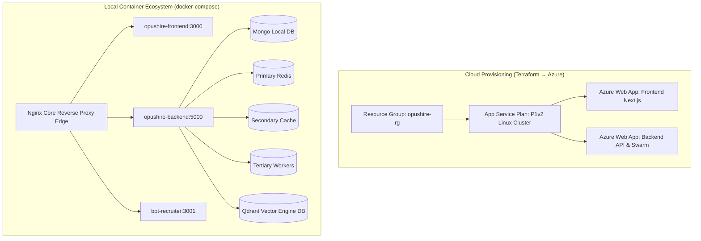

<div align="center">
  <h1>🏗 Infrastructure & DevOps</h1>
  <p><strong>OpusHire's Cloud-Native Backbone</strong></p>
</div>

This directory encapsulates the DevOps toolchain powering the local ecosystem and remote Azure App Service provisioning for OpusHire.

## 🚀 1. Automated Provisioning via Terraform (Azure)
The `main.tf` orchestrates zero-downtime infrastructure as code (IaC) directly into Microsoft Azure.

- **Stack Focus:** Native Linux App Services tailored mechanically for Node.js workloads.
- **Resource Composition:**
  - `azurerm_resource_group`: Creates the parent `opushire-rg` in Central India.
  - `azurerm_service_plan`: Spawns a high-performance `P1v2` Linux cluster.
  - `azurerm_linux_web_app`: Explicitly spins up two App Services (`opushire-frontend-app` and `opushire-backend-app`).
- **Configuration Overrides:** Automatically binds `NODE_ENV=production` and points default Next.js server routing via `site_config`.

```bash
# Provision Azure cluster mechanically
terraform init
terraform plan
terraform apply
```

## 🐳 2. Local Container Ecosystem (Docker & Multi-DB)
The root `docker-compose.yml` deploys a synchronized 9-container stack simulating our exact production logic on `localhost`.

- **Web Tiers:** `frontend` (Next.js) & `backend` (Express.js) & `recruiter-bot` (Nest.js-style scraper).
- **Agents:** `python_agents` (CrewAI daemon syncing against MongoDB).
- **Tri-Redis Cluster Architecture:**
  - `redis_primary`: Handles critical application queues via BullMQ.
  - `redis_secondary`: Fallback cache mechanism.
  - `redis_tertiary`: Observational endpoints for the `/api/admin/health` health probes.
- **Vectors & Auth:** Localized `Qdrant` vector database and MongoDB configurations.

## 🔒 3. Ingress Reverse Proxy (`nginx.conf`)
If running bare-metal, `nginx.conf` acts as an edge router intercepting Layer 7 traffic to append secure headers (X-Frame-Options, X-XSS-Protection) and securely proxies `wss://` WebSocket upgrades for the Next.js real-time admin metrics dashboard.

### IaC & Local Docker Swarm Orchestration

