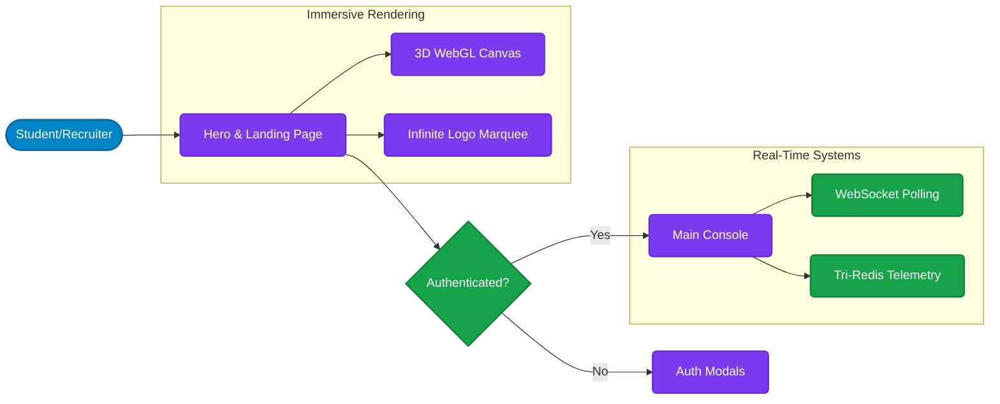

# Opushire Frontend (Next.js Application)

This is the front-end application for the **Opushire** premium student job portal. It is built using modern React server components and a custom glassmorphism design system.

## 🚀 Tech Stack

- **Framework:** [Next.js 15](https://nextjs.org/) (App Router, Server/Client components)
- **Language:** TypeScript
- **Styling:** [Tailwind CSS v4](https://tailwindcss.com/)
- **Animations:** [Framer Motion](https://www.framer.com/motion/) & GSAP
- **Icons:** Lucide React
- **State Management:** React Context API (e.g. `AuthContext`)

---

## 🎨 Premium UI/UX Design

The Opushire frontend is designed with an immersive "Glassmorphism" aesthetic intended to target ambitious students and innovative tech startups. 

Key design elements include:
- Frosted glass cards using Tailwind's `backdrop-blur`.
- Infinite animated company marquees with CSS gradient masks.
- Dynamic `ScrollReveal` fading down/up interactions across the landing and inner pages.
- Elegant multi-step gradient text (`.text-gradient`).
- **Enterprise Admin Dashboard:** Real-time system monitoring panel via polling that presents dynamic MongoDB & Redis outage heuristics.

### Frontend Component Architecture Flow


---

## 🛠 Local Setup & Development

To run this frontend module independently, ensure you have the `opushire-backend` running simultaneously on `localhost:5000` to handle authentication and data fetching.

### 1. Installation

```bash
cd opushire
npm install
```

### 2. Environment Variables

Create a file named `.env.local` in the root of the `opushire` directory:

```env
# Point this to your local backend server during development
NEXT_PUBLIC_API_URL=http://localhost:5000/api
```

### 3. Running the Server

Start the Next.js development server:

```bash
npm run dev
```

Open [http://localhost:3000](http://localhost:3000) with your browser to see the result.

*(Troubleshooting Tailwind v4: If visual styles are failing to compile locally after running the server for long periods, delete the hidden `.next/` directory inside this folder and restart the `npm run dev` script to clear the cache).*

---

## ☁️ Continuous Integration & Deployment

This application is configured for fully automated CI/CD deployments to **Microsoft Azure App Services** using **GitHub Actions**.

Whenever code is pushed to the target branch (e.g. `soumik`), the GitHub Workflow located in `.github/workflows/` automatically:
1. Installs dependencies.
2. Injects production environment variables.
3. Compiles the Next.js standalone application build.
4. Zips the `.next/standalone` payload.
5. Deploys the `.zip` artifact to the specified Azure App Service container.

You can view the live output at: [https://opushire-frontend-app-hbarc3h7ckashzhb.centralindia-01.azurewebsites.net](https://opushire-frontend-app-hbarc3h7ckashzhb.centralindia-01.azurewebsites.net)
