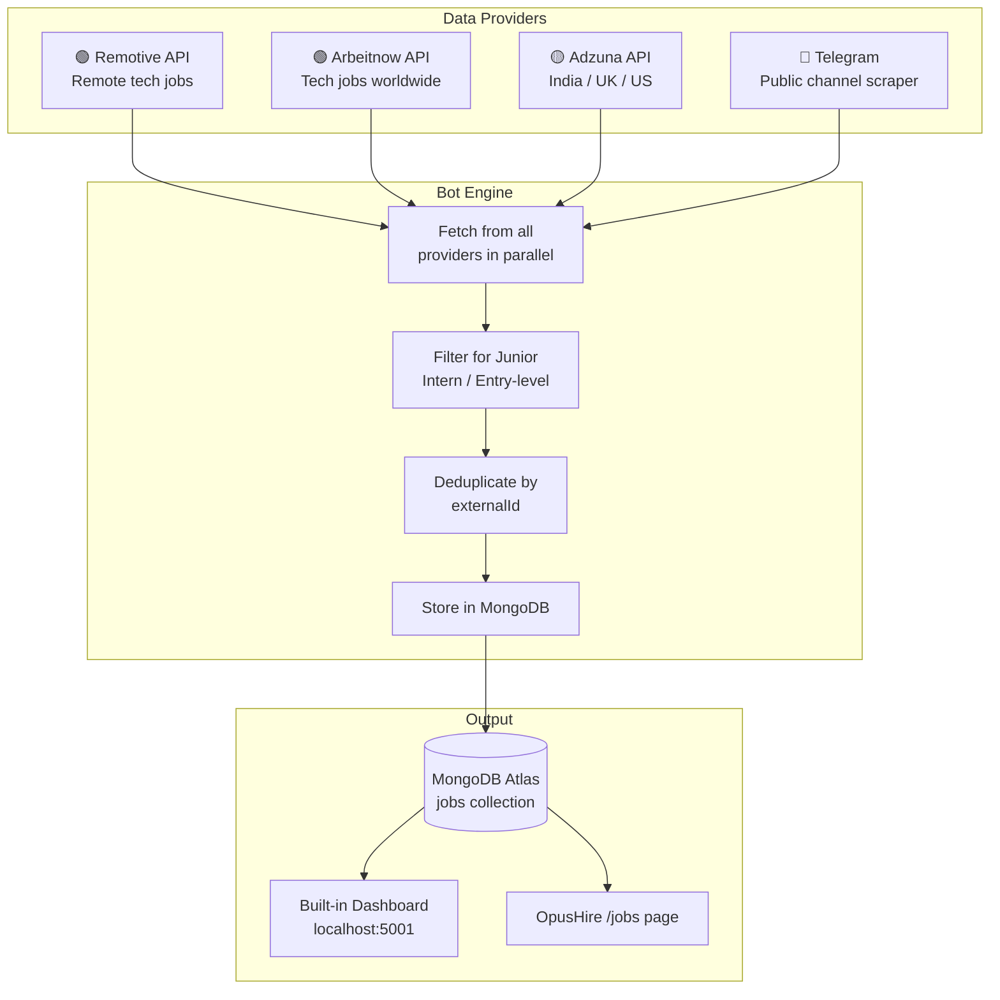
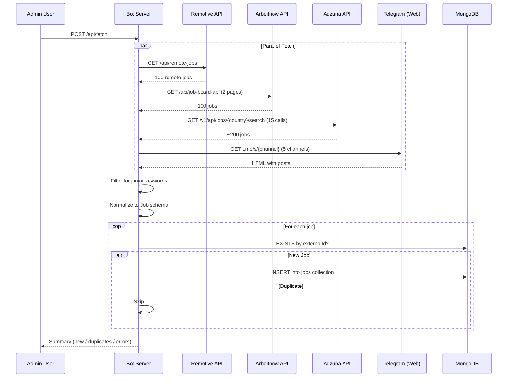
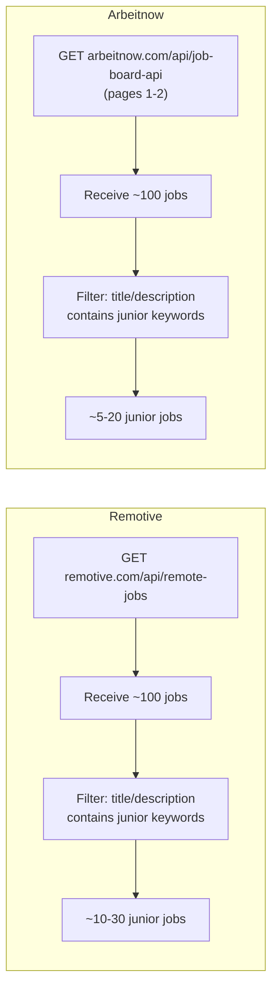
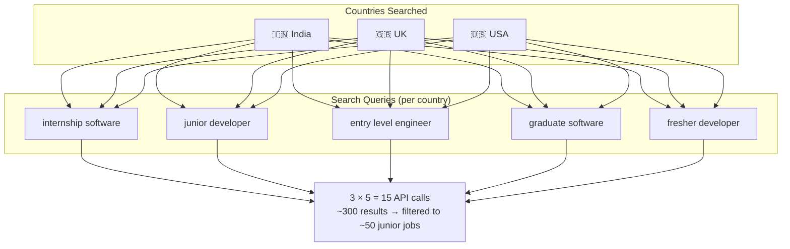
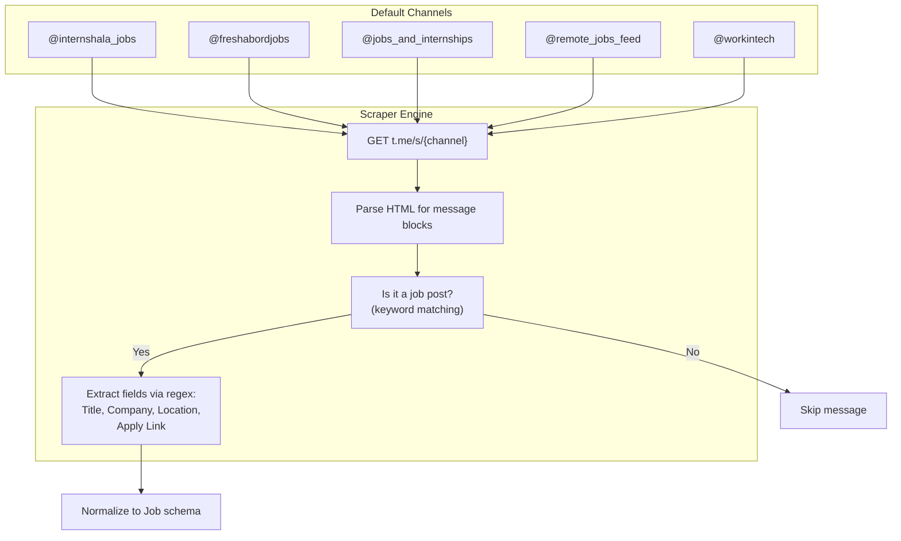
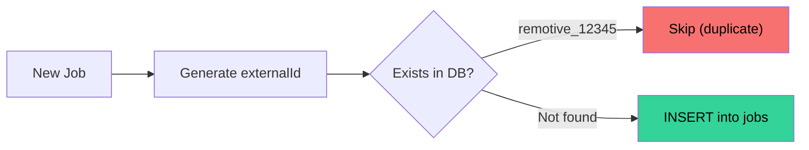

<div align="center">
  <h1>🤖 Recruiter Bot</h1>
  <p><strong>OpusHire's Autonomous Job Fetcher</strong></p>
  <p>Pulls internship & junior-level jobs from 4 external sources and stores them in the shared MongoDB <code>jobs</code> collection.</p>

  [](#)
  [](#)
  [](#)
  [](#)
</div>

---

## 🏗 Architecture Overview



---

## 🔄 Data Flow — What Happens When You Click "Fetch"



---

## 📦 Provider Details

### Phase 1: Remotive + Arbeitnow (Free, No API Key)



**Junior Keywords Filter:**
`intern`, `internship`, `junior`, `entry-level`, `graduate`, `fresher`, `trainee`, `associate`, `apprentice`, `beginner`, `new grad`

---

### Phase 2: Adzuna (API Key Required)



**Rate Limits (Trial Access):** 250 requests/month, 10 requests/minute

---

### Phase 3: Telegram (Public Channel Scraper)



**How extraction works:**
| Field | Regex Pattern |
|-------|--------------|
| Title | `hiring\|opening\|vacancy\|role` followed by text |
| Company | `company\|org\|at` followed by text, or 🏢 emoji |
| Location | `location\|place\|city` followed by text, or 📍 emoji |
| Apply Link | First URL found in the post |
| Mode | Contains `remote\|wfh\|hybrid` keywords |

---

## 🔑 Deduplication System



Each provider generates a unique `externalId`:
- Remotive: `remotive_{api_id}`
- Arbeitnow: `arbeitnow_{slug}`
- Adzuna: `adzuna_{api_id}`
- Telegram: `telegram_{channel}_{content_hash}`

---

## 🚀 Quick Start

```bash
cd recruiter-bot
npm install
cp .env.example .env
# Edit .env → set MONGODB_URI (same as your OpusHire backend)
```

### Option 1: Dashboard (Web UI)
```bash
npm run dev
# Open http://localhost:5001
# Click "Fetch New Jobs" button
```

### Option 2: CLI (One-Off)
```bash
npm run fetch
# Prints results to terminal and exits
```

### Option 3: Build for Production
```bash
npm run build
npm start
```

---

## ⚙️ Configuration

| Env Variable | Required | Description |
|---|---|---|
| `MONGODB_URI` | ✅ | Same MongoDB as OpusHire backend |
| `PORT` | ❌ | Server port (default: 5001) |
| `RECRUITER_BOT_ADMIN_KEY` | ✅ (for remote access) | Required for non-loopback API calls via `x-bot-admin-key` |
| `ADZUNA_APP_ID` | ❌ | Adzuna Application ID |
| `ADZUNA_API_KEY` | ❌ | Adzuna API Key |
| `TELEGRAM_CHANNELS` | ❌ | Comma-separated channel names (overrides defaults) |

---

## 📊 API Endpoints

| Method | Path | Description |
|--------|------|-------------|
| `GET` | `/` | Built-in dashboard UI (public shell; prompts for key remotely) |
| `GET` | `/api/status` | Bot status, last run time, stats per source (requires `x-bot-admin-key` remotely) |
| `POST` | `/api/fetch` | Trigger a new fetch cycle (requires `x-bot-admin-key` remotely) |
| `GET` | `/api/jobs` | List bot-fetched jobs (requires `x-bot-admin-key` remotely) |

Remote API example:

```bash
curl -H "x-bot-admin-key: YOUR_KEY" http://<host>:5001/api/status
```

---

## 📁 File Structure

```
recruiter-bot/
├── src/
│   ├── models/
│   │   └── Job.ts                  ← Mongoose schema (same collection as OpusHire)
│   ├── providers/
│   │   ├── remotive.provider.ts    ← Phase 1 — Remote tech jobs
│   │   ├── arbeitnow.provider.ts   ← Phase 1 — Global tech jobs
│   │   ├── adzuna.provider.ts      ← Phase 2 — Multi-country search
│   │   └── telegram.provider.ts    ← Phase 3 — Channel scraper
│   ├── bot.service.ts              ← Orchestrator (fetch → filter → dedup → store)
│   ├── server.ts                   ← Express server + built-in HTML dashboard
│   └── cli.ts                      ← CLI tool for cron/manual runs
├── package.json
├── tsconfig.json
├── .env.example
└── README.md
```
